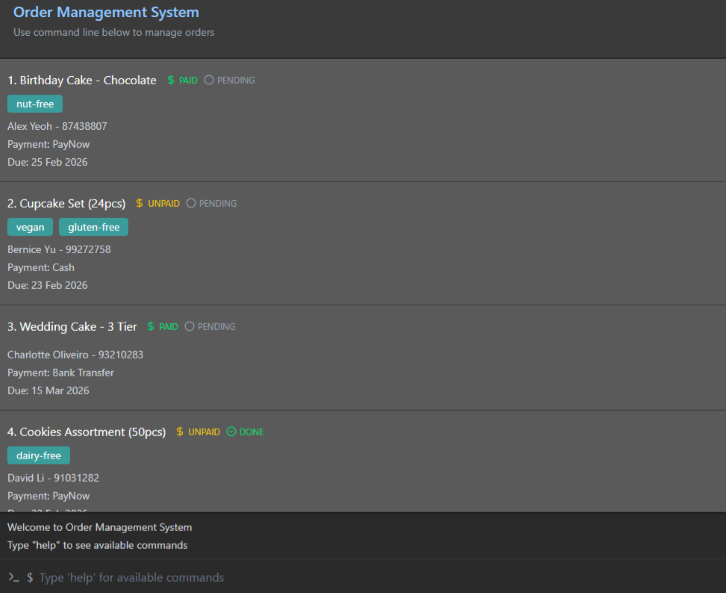

* HomeChef-Helper is a contact list desktop application for handling food and beverage (F&B) orders.
  * It is meant to help manage orders and information for simple F&B sellers working from home.
  * It can track contact and payment information from customers.
  * It can highlight special dietary requirements of customers.
* This project is based on the [AddressBook-Level3 project](https://se-education.org/addressbook-level3) created by the [SE-EDU initiative](https://se-education.org).
  * It is **written in OOP fashion**. It provides a **reasonably well-written** code base **bigger** (around 6 KLoC) than what students usually write in beginner-level SE modules, without being overwhelmingly big.
  * It comes with a **reasonable level of user and developer documentation**.
* For the detailed documentation of this project, see the **[HomeChef-Helper Product Website](https://ay2526s2-cs2103t-t13-4.github.io/tp/)**.
* This project is a **part of the se-education.org** initiative. If you would like to contribute code to this project, see [se-education.org](https://se-education.org/#contributing-to-se-edu) for more info.
