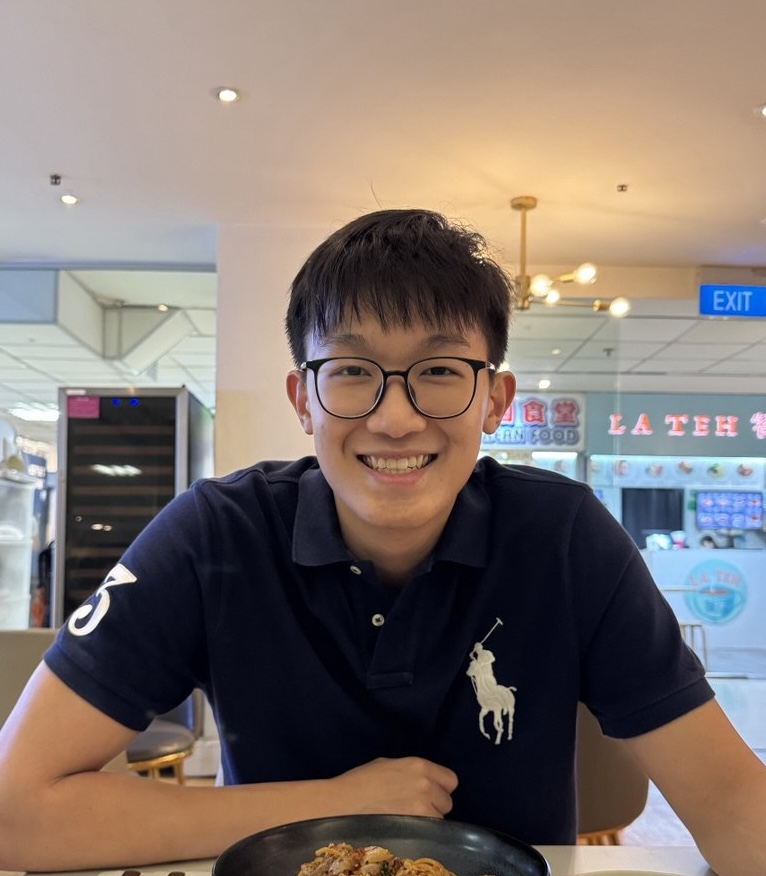

We are a team based in the [School of Computing, National University of Singapore](https://www.comp.nus.edu.sg).

You can reach us at the email `seer[at]comp.nus.edu.sg`

## Project team

### Omgeta

[[github](https://github.com/Omgeta)]
[[portfolio](team/johndoe.md)]

- Role: Code Quality
- Responsibilities: Logic

### Jane Doe

[[github](http://github.com/johndoe)]
[[portfolio](team/johndoe.md)]

- Role: Team Lead
- Responsibilities: UI

### Sern Yuan

[[github](http://github.com/serny-afk)] [[portfolio](team/johndoe.md)]

- Role: Developer
- Responsibilities: Data

### Joshua Teo

[[github](http://github.com/JoshTKx)]

- Role: Developer
- Responsibilities: Dev Ops + Threading

### Oh Yi Xian

[[github](http://github.com/Yixiannya)]
[[portfolio](team/johndoe.md)]

- Role: Documentation
- Responsibilities: Model
